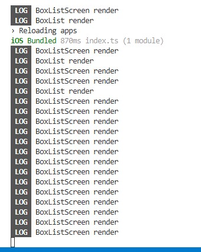
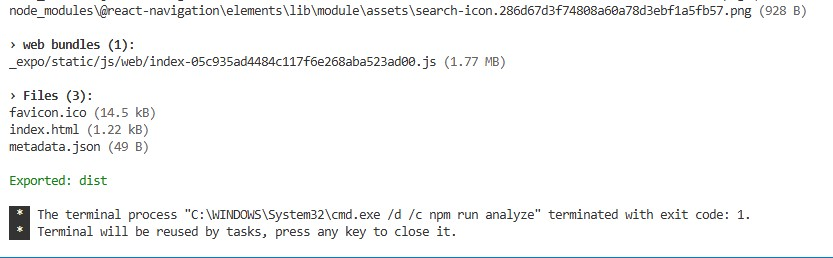
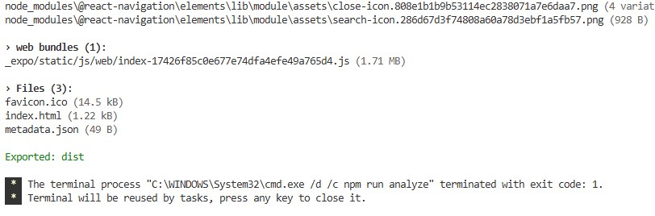

# Завдання 1
Виявив у package.json використання statusbar котрий не використовується - видалив.

# Завдання 2

Додано анімацію на додавання нової коробки до списку
  ```tsx
  
  if (
    Platform.OS === "android" &&
    UIManager.setLayoutAnimationEnabledExperimental
  ) {
    UIManager.setLayoutAnimationEnabledExperimental(true);
  }

  ...

  LayoutAnimation.configureNext(LayoutAnimation.Presets.easeInEaseOut);
  ```


# Завдання 3
Я перевіряв роботу бібліотеки [`@welldone-software/why-did-you-render`](https://github.com/welldone-software/why-did-you-render), яка допомагає виявляти непотрібні ререндери.

## Що було зроблено

Додано штучний стан `counter` у `BoxListScreen` та кнопку **Increment** для виклику повторних ререндерів:

  ```tsx
  <Button label="Increment" onPress={() => setCounter((c) => c + 1)} />
  ```
У компоненті `BoxListScreen` виводився лог:
  ```tsx
  console.log("BoxListScreen render");
  ```

У компоненті `BoxList` виводився лог:

  ```tsx
  console.log("BoxList render");
  ```

Увімкнено відстеження в `App.tsx`:

  ```tsx
  const whyDidYouRender = require("@welldone-software/why-did-you-render");
  whyDidYouRender(React, {
    trackAllPureComponents: true,
    trackHooks: true,
    collapseGroups: false,
  });
  ```

Змінено handleOpen на використання useCallback у BoxListScreen 
```tsx
  const handleOpen = useCallback(
    (box: Box) => {
      navigation.navigate(boxesStackRoutes.BOX_DETAILS, { boxId: box.id });
    },
    [navigation]
  );
```

## Результати

При натисканні на **Increment** у консолі з’являвся тільки:

  ```
  BoxListScreen render
  ```
Повторного `BoxList render` не було. Що є очікувано, а от до цієї зміни 

Повідомлення `[why-did-you-render] ... unnecessary` не з’являлося. ❓❓❓Чому так і не зміг знайти причину❓❓❓




# Завдання 4
З використанням moment
```tsx
  const newBox = {
      title: `New box #${n}`,
      createdAt: moment().toISOString(),
     ...
    };
```


З використанням moment
```tsx
  const newBox = {
      title: `New box #${n}`,
      createdAt: new Date().toISOString(),
    };
```
